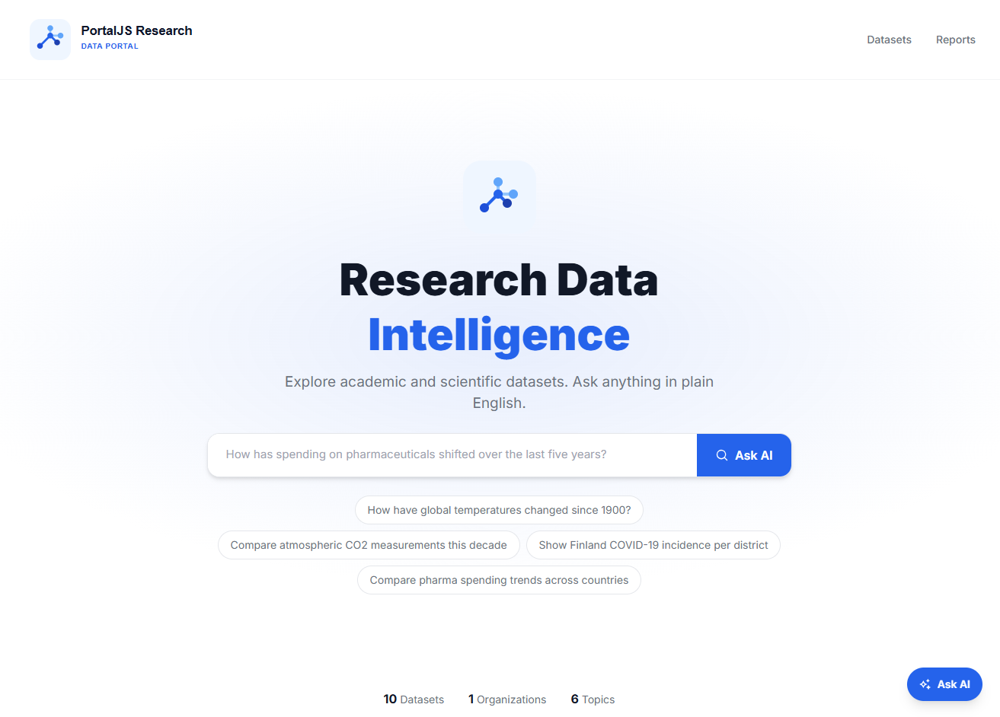
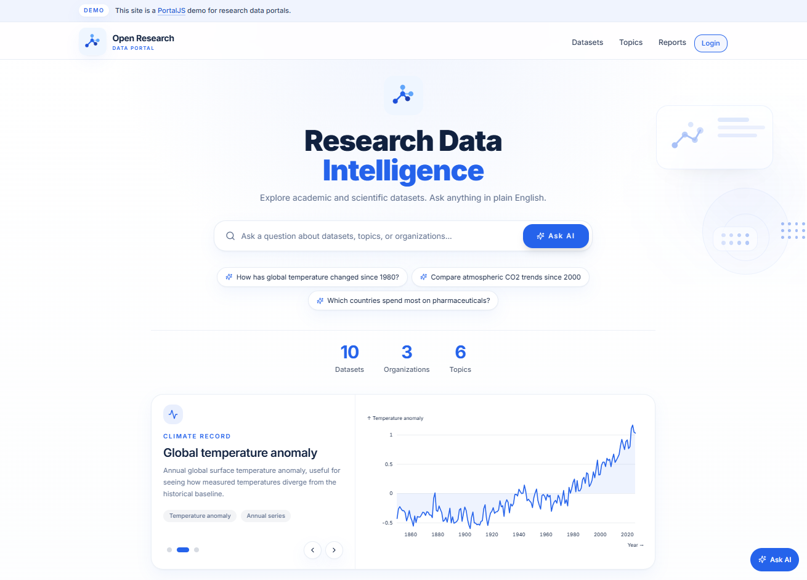
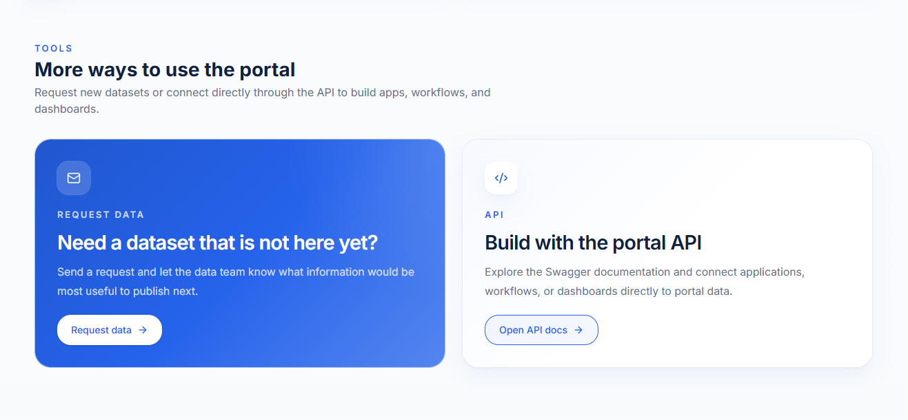
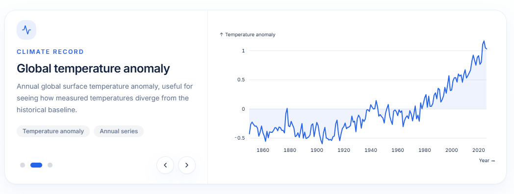
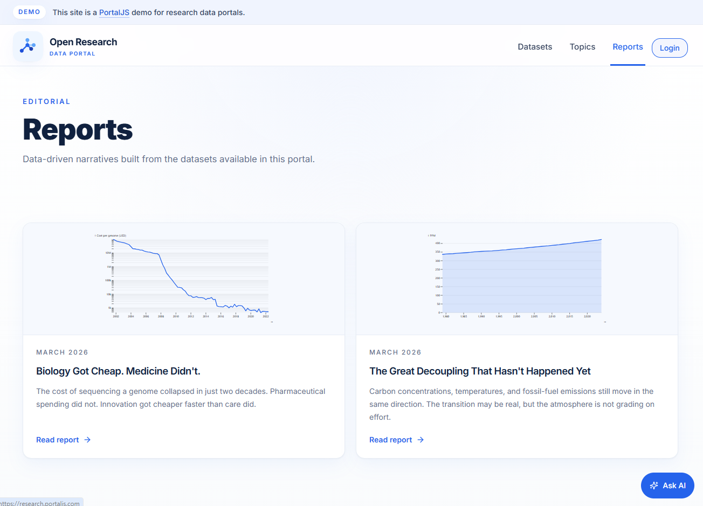
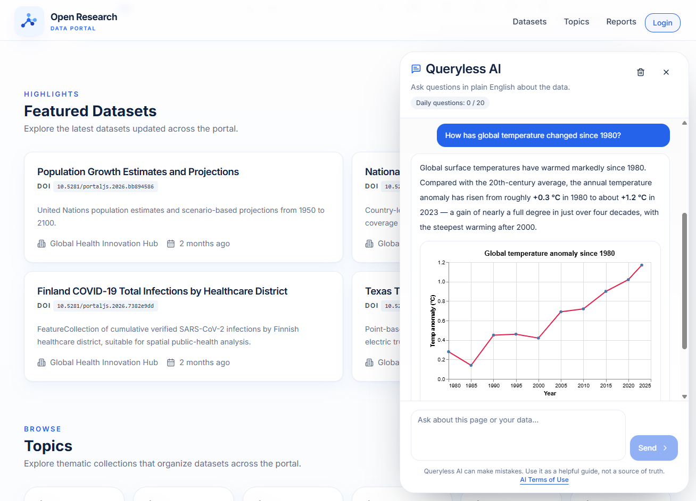
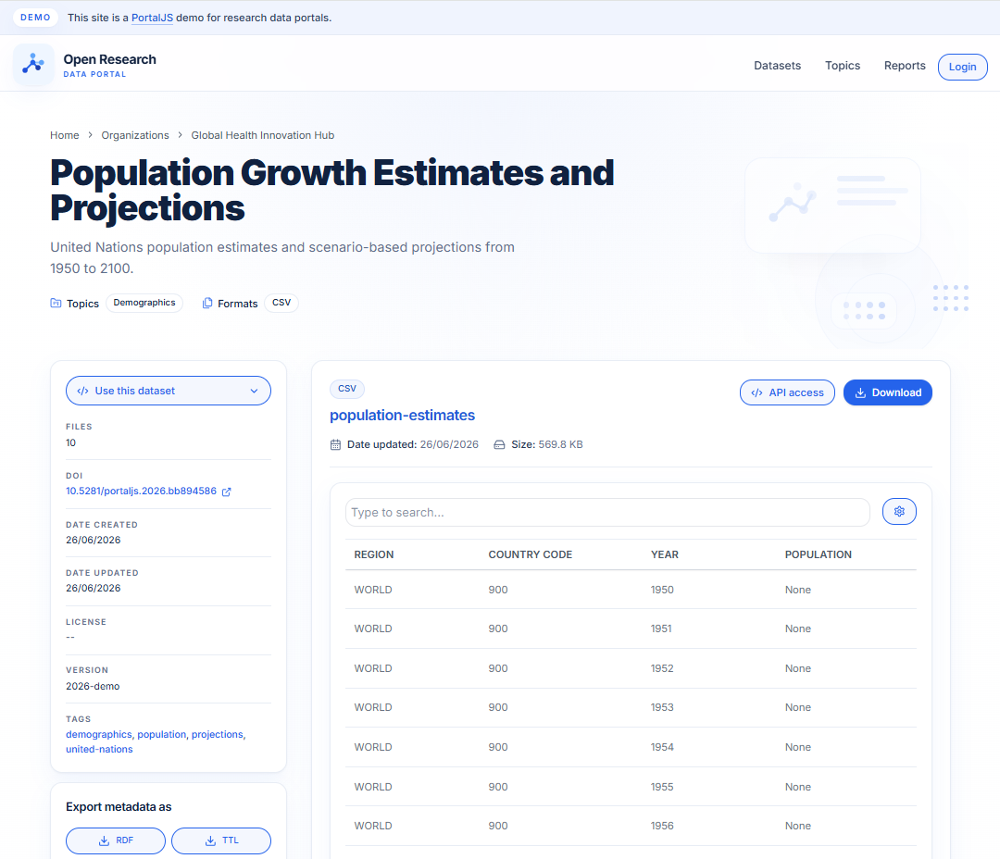
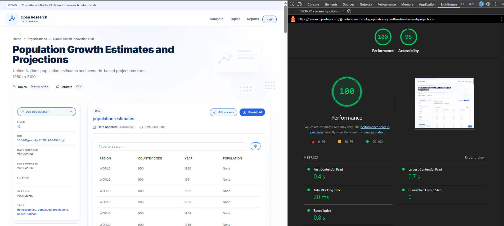

# A clearer, faster home for research data

Finding research data should feel simple. You should understand where you are, what data is available, and how to use it.

We recently improved our [research data portal demo](https://research.portaljs.com/). The result is a clearer interface, more useful data pages, and a newer technical foundation.

## What changed

Here is the short version:

* A clearer research portal identity, demo banner, favicon, and navigation
* Working links for featured collections, Login, Request data, and other important actions
* A more useful homepage with stronger visuals, reports, and charts built from portal resources
* Better datasets, resources, metadata labels, descriptions, and previews
* A repaired Ask AI experience with clear guidance about live and prepared answers
* Built-in support for adding more languages
* Simple colour and branding customisation
* A move to Next.js 15, React 19, and the App Router
* Faster page delivery through static generation, server rendering, parallel requests, and Incremental Static Regeneration
* Better loading states, error handling, and accessibility checks

Some of these changes are easy to see. Others happen behind the screen. Both are important.

## A clearer first visit

The portal now opens with a banner that clearly identifies it as a PortalJS demo for research data portals. This helps visitors understand that the content is an example, not an official institutional repository.

The main identity changed from PortalJS Research to Open Research. Product branding is no longer the main focus of the page. The portal itself comes first, while PortalJS is still credited in the demo notice and footer.

Navigation now uses clear links to Datasets, Topics, and Reports. A Login button appears when the data management system is configured. The favicon was also fixed, which makes the portal easier to recognise among open browser tabs.



*Before: the page used PortalJS Research as its main identity. It had a simpler navigation, no demo notice, and no Login action.*



*After: the demo is clearly identified, the portal has its own Open Research identity, and the first screen includes better navigation, useful statistics, and a chart-based data signal.*


## Ready for more languages

The demo is currently in English, but adding another language is simple: translate the interface text, choose which languages to offer, and select the default. The portal handles the rest, including a language switcher when more than one language is available.

## Easy to match your brand

The portal’s main colour can be changed in one place. This updates buttons, links, logos, and background details across the site, making it easy to match an institution’s brand.

Simply update the brand colour in `src/app/portal-theme.css`:

```css
:root {
  --brand-accent: #1d83d4;
}
```

## Better paths through the portal

Good navigation is not only about menu labels. Every link needs to take the visitor somewhere useful.

We repaired links for featured datasets, topic collections, reports, and resources. The Request data button no longer leads to a missing page. It now opens an email request. The API action opens the CKAN 2.11 documentation.

The homepage also includes stronger background visuals in sections that previously felt empty. Featured datasets, topics, and reports are easier to identify and explore.

Together, these changes create a more complete journey. A visitor can start on the homepage, find a dataset, open a resource, and understand how to use it without meeting a broken link on the way.



*The refreshed call to action gives visitors two clear next steps: request a missing dataset by email or open the API documentation to build with portal data.*


## Data that starts to tell a story

A data portal should do more than list files. It should help visitors understand why the data may be useful.

The homepage now includes a Data signals carousel. It reads CSV resources from the portal and turns them into line or bar charts. The chart system can group, filter, sort, and summarise values.

These are not pasted images. They are created from portal resources. If a resource is unavailable or does not contain useful chart data, the page shows a readable message instead of breaking the full section.

Reports add another layer. They show how published datasets can support a clear, data-driven story.



*The Data signals carousel turns portal resources into clear charts. This example shows how global temperature anomalies have changed since the mid-19th century.*



*The Reports page brings data-driven stories together in one place, helping visitors move from individual datasets to wider research insights.*

## Ask the portal in normal language

Search works well when you already know the correct words. Research questions are not always that tidy.

[Queryless](https://www.portaljs.com/blog/talk-to-your-data-portal-in-plain-english-introducing-queryless-ai) lets visitors ask questions in plain English. It can use the current page as context and return formatted text and charts.

The demo has two types of interaction:

* The suggested homepage questions use prepared, illustrative answers. This keeps the demonstration predictable.
* Questions typed by a visitor can use the live Queryless service when it is configured.

The assistant also warns that AI can make mistakes and should be used as a guide, not as a source of truth. This is especially important for research users.



## The quiet work behind the interface

The visible portal is only part of the work. Useful research data also needs clean metadata and working resources.

We improved how the portal reads dataset and resource metadata, formats labels and descriptions, handles CSV files, and presents fields. Shared resource and CSV helpers now apply the same rules across charts and data previews. Broken responses are handled more safely.

Depending on the available data, dataset pages can now provide:

* APA and BibTeX citations
* metadata exports
* examples for curl, Python, and R
* CSV tables and filters
* PDF, JSON, iframe, and GeoJSON previews
* clearer links between datasets, organisations, and topics

This work helps visitors decide whether a dataset is relevant and whether they can reuse it.




## A newer and faster foundation

The largest change is one visitors may never see.

We moved the portal from Next.js 13 and the Pages Router to Next.js 15 and the App Router. We also upgraded from React 18 to React 19, TypeScript 4.7 to TypeScript 5, and Tailwind CSS 3 to Tailwind CSS 4.

The App Router gives the portal a clearer structure for pages, shared layouts, loading states, and metadata. It also gives us better control over what happens on the server and what needs to run in the visitor’s browser.

The new portal uses several performance methods:

* Selected pages can be prepared before a visitor opens them.
* Main routes and CKAN requests use a 60 second revalidation setting.
* Incremental Static Regeneration can refresh prepared content without rebuilding the complete portal.
* Homepage data requests run in parallel.
* Each route has a loading layout shaped like the page that is coming.
* Heavy interactive features, such as maps, load only when needed.
* CKAN requests can retry after a temporary network problem.

This creates a better foundation for research institutions that want to add collections, serve more visitors, and continue improving their portal.



## More confidence with every change

Automated accessibility checks now visit portal routes and test them with Axe using WCAG AA rules. These checks include static pages and sample dataset and resource pages. We also fixed colour contrast, CSV errors, and dependency security issues.

Accessibility work is never finished, but repeatable checks help prevent common problems from returning.

## One portal, a better journey

The refreshed demo is easier to recognise, explore, and maintain.

Visitors get clearer navigation, useful charts, richer dataset pages, working actions, and an honest AI demonstration. Data teams get a modern application structure, reusable components, safer resource handling, and better automated checks.

A research portal is never really finished. The data changes, institutions grow, and people arrive with new questions. That is part of the fun.

Try the [research data portal demo](https://research.portaljs.com/). Start with a question, open a dataset, inspect a resource, and see whether the portal helps you reach an answer.
